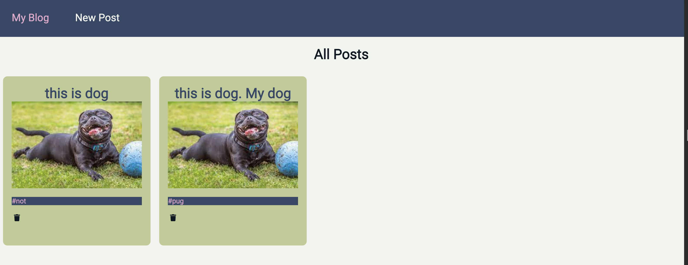

# Lab 4 - Redux Platform

*This is a blog platform with redux integration.*

[deployed url](https://frosty-pike-90952a.netlify.app/)

## What Worked Well
The lab was really helpful to better understand redux. I had no issues with any of the get requests and could display posts immediately.

## What Didn't
I had a lot of issues with my delete function and how to best deal with refresh fucntionality. Luckily, after some slack questions, I figured out how to best delete and refresh my redux state. I also just had minor issues remebering to get functions from props and whatnot.

## Extra Credit
For extra credit, I implemented error handeling with redux. This means that I made an error action and saved the error in redux state. Thus, of any errors occur wtih axios, a react bootstrap alert will appear with the error message. To try this, change the request url in fetch posts.

For SA 7 extra credit, I added a profile page complete with updated actions and reducers and route updates on backend.

## Screenshots

